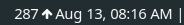

# nightscout-i3

- [nightscout-i3](#nightscout-i3)
  - [Overview](#overview)
  - [Dependencies](#dependencies)
  - [Fontawesome upgrade](#fontawesome-upgrade)
  - [Installation](#installation)
  - [Usage](#usage)
  - [Run tests](#run-tests)
  - [i3 Configuration](#i3-configuration)
    - [Create a `status.sh` script](#create-a-statussh-script)
    - [Update the configuration file](#update-the-configuration-file)
  - [References](#references)
  - [TODO](#todo)
  - [License](#license)

## Overview

This project retrieves data from [Nightscout](https://nightscout.github.io/) and updates the [i3 status bar](https://i3wm.org/docs/i3status.html) on any
GNU/Linux distribution with `i3wm` installed.



## Dependencies

See the [Requirements file](../requirements.txt)

## Fontawesome upgrade

The project `nightscout-i3` uses the library [Fontawesome Python](https://github.com/justbuchanan/fontawesome-python)
which is now abandoned.
If you want to get the latest Fontawesome icons you must generate the list again.
Find where the package was installed:

```bash
$ pacman -Ql python-fontawesome

python-fontawesome /usr/
python-fontawesome /usr/lib/
python-fontawesome /usr/lib/python3.12/
python-fontawesome /usr/lib/python3.12/site-packages/
python-fontawesome /usr/lib/python3.12/site-packages/fontawesome-5.10.1.post1-py3.12.egg-info/
python-fontawesome /usr/lib/python3.12/site-packages/fontawesome-5.10.1.post1-py3.12.egg-info/PKG-INFO
python-fontawesome /usr/lib/python3.12/site-packages/fontawesome-5.10.1.post1-py3.12.egg-info/SOURCES.txt
python-fontawesome /usr/lib/python3.12/site-packages/fontawesome-5.10.1.post1-py3.12.egg-info/dependency_links.txt
python-fontawesome /usr/lib/python3.12/site-packages/fontawesome-5.10.1.post1-py3.12.egg-info/top_level.txt
python-fontawesome /usr/lib/python3.12/site-packages/fontawesome/
python-fontawesome /usr/lib/python3.12/site-packages/fontawesome/__init__.py
python-fontawesome /usr/lib/python3.12/site-packages/fontawesome/__pycache__/
python-fontawesome /usr/lib/python3.12/site-packages/fontawesome/__pycache__/__init__.cpython-312.opt-1.pyc
python-fontawesome /usr/lib/python3.12/site-packages/fontawesome/__pycache__/__init__.cpython-312.pyc
python-fontawesome /usr/lib/python3.12/site-packages/fontawesome/__pycache__/generate.cpython-312.opt-1.pyc
python-fontawesome /usr/lib/python3.12/site-packages/fontawesome/__pycache__/generate.cpython-312.pyc
python-fontawesome /usr/lib/python3.12/site-packages/fontawesome/__pycache__/icons.cpython-312.opt-1.pyc
python-fontawesome /usr/lib/python3.12/site-packages/fontawesome/__pycache__/icons.cpython-312.pyc
python-fontawesome /usr/lib/python3.12/site-packages/fontawesome/generate.py
python-fontawesome /usr/lib/python3.12/site-packages/fontawesome/icons.py
```

Generate the new icon list by executing the following:

```bash
cd /usr/lib/python3.12/site-packages/fontawesome/
python3 ./generate.py --revision 6.6.0 > icons.py
```

Sometimes the generated file is generated with errors, for those cases you can find the `icons.py` file [here](../utils/icons.py).
Please, backup the original `icons.py` file and copy the provided one to the same directory.

## Installation

1. Clone the repository:

   ```bash
   git clone https://github.com/balcruz/nightscout-i3.git
   cd nightscout-i3
   ```

2. Create a virtual environment

```bash
# Navigate to your project directory
cd nightscout-i3

# Create a virtual environment named 'venv'
python -m venv venv

# Activate the virtual environment
# On Linux or macOS
source venv/bin/activate

```

3. Environment file

Add your values to the following variables in the `.env` file:

- `NIGHTSCOUT_HOST`
- `NIGHTSCOUT_API_TOKEN`
- `TIMEZONE`

4. Install

```bash
  make install
```

## Usage

```bash
  make run
```

or

```bash
 NIGTHSCOUT_HOST="<heroky|fly.dev|... host>" NIGTHSCOUT_API_TOKEN="some-api-token" TIMEZONE="America/Montevideo" python3 src/main.py
```

## Run tests

Execute the following

```bash
make test
```

## i3 Configuration

### Create a `status.sh` script

Create a script `$HOME/bin/status.sh` with the following content:

```bash
#!/bin/sh

i3status | while :; do
  read line
  data=$(~/bin/nightscout.py)
  echo "${data} | $line" || exit 1
done
```

### Update the configuration file

Open the `i3wm` configuration file (i.e: `$HOME/.i3/config`) and replace the line

```bash
 status_command i3status
```

with the following:

```bash
 status_command exec $HOME/bin/status.sh
```

## References

- [Nightscout site](https://nightscout.github.io/)
- [i3wm site](https://i3wm.org/)
- [Fontawesome Python](https://github.com/justbuchanan/fontawesome-python)

## TODO

- Update tests
- Change arrows (possibly using another library)
- Add a chart with last N hours
- Show values with colors (in-range, low, high)

## License

This project is licensed under the MIT License.
